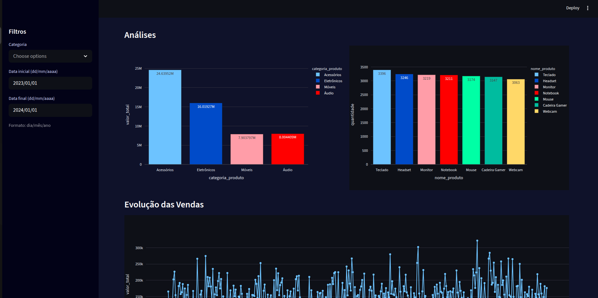

# InsightFlow Analytics
Projeto de análise de dados de e-commerce desenvolvido para o desafio de Dados (Data Analytics) do PD - Projeto Desenvolve

## Objetivo
Transformar dados brutos de vendas em insights de negócio utilizando Python, ETL e Visualização Interativa de um dataset simulado.

O projeto utiliza um dataset simulado de e-commerce. Os dados são gerados via script.

## Este projeto entrega:
- Geração de dataset com mais de 5000 registros
- Pipeline de ingestão e tratamento de dados
- Armazenamento em PostgreSQL
- Análises exploratórias com Python e SQL
- Dashboard interativo com Streamlit
- Indicadores estratégicos para tomada de decisão

## Tecnologias utilizadas
- Python
- Pandas
- PostgreSQL
- SQLAlchemy
- Streamlit
- Plotly

**Sprint 1**: Ingestão e ETL (Limpeza de Dados)
- Geração do dataset simulado (ecom_data.csv) com 5000 linhas ou mais;
- Tratamento de valores nulos, duplicados e inconsistentes;
- Padronização de formatos (datas, moedas) e
- Carga dos dados tratados num banco de dados relacional.

**Sprint 2**: Análise Exploratória (EDA) e SQL
- Estatísticas descritivas
- Faturamento total
- Produtos mais vendidos
- Vendas por categoria
- Identificação de possíveis outliers
- Correlação entre variáveis
- Segmentação de clientes (RFM)

**SQL**:
Foram realizadas consultas com:
- GROUP BY
- ORDER BY
- Funções de agregação
- Window Functions (RANK)

Arquivo disponível em:
```
sql/queries.sql
```

**Sprint 3**: Visualização e Dashboard

Funcionalidades:
- KPIS principais:
    - Faturamento total
    - Número de vendas
    - Produtos vendidos
    - Ticket médio

- Filtros dinâmicos:
    - Categoria de produto
    - Período de vendas

- Visualizações:
    - Vendas por categoria
    - Produtos mais vendidos
    - Série temporal (evolução das vendas)

**Sprint 4**: Storytelling e Modelo Preditivo
    - Implementação de um modelo simples de Regressão Linear para previsão de vendas
    - Documentação detalhada dos insights
    - README final

Como executar o dashboard:
```
streamlit run dashboard/dash.py
```

## Estrutura do Projeto
```
insightflow-analytics

    dashboard
    └── dash.py

    data
    ├── raw
    │   └── ecom_data.csv
    |
    └── processed
        └── ecom_data_tratado.csv

    src
    ├── gera_dados.py
    ├── ingestao_dados.py
    ├── trata_dados.py
    └── carrega_postgres.py

    sql
    └── queries.sql

    ├── .gitignore
    ├── requirements.txt
    └── README.md


                   gera_dados.py
                        ↓
                ingestao_dados.py
                        ↓
                   trata_dados.py
                        ↓
               carrega_postgres.py
                        ↓
                    PostgreSQL
```

## Como Rodar
1. Clonar o repositório:
```
git clone https://github.com/anapaulalopes93/insightflow-analytics.git
cd insightflow-analytics
```
2. Criar e ativar o ambiente virtual:
```
python3 -m venv .venv
source .venv/bin/activate   # Para ativar no Linux/macOS
.venv\Scripts\activate      # Para ativar no Windows
```
3. Instalar dependências:
```
pip install -r requirements.txt
```
4. Gerar o dataset simulado:
```
python src/gera_dados.py
```
- O dataset será salvo em data/raw/ecom_data.csv

5. Tratar os dados e padronizar formatos:
```
python src/trata_dados.py
```
- Os dados tratados serão salvos em data/processed/ecom_data_tratado.csv

6. Carregar os dados tratados no banco de dados:
```
python src/carrega_postgres.py
```

7. Executar o dashboard
```streamlit run dashboard/dash.py
```
- Os dados serão inseridos em um banco de dados relacional configurado em src/carrega_postgres.py

## Pipeline de Dados
1. Geração de dataset simulado de e-commerce
2. Ingestão de dados
3. Transformação (ETL)
4. Carga dos dados tratados no banco relacional
5. Análise de vendas
6. Dashboard interativo

## Funcionalidades do Dashboard
- KPIs de faturamento, volume de vendas e ticket médio
- Comparação ano a ano
- Análise temporal de vendas
- Ranking dinâmico por produto e categoria
- Filtros interativos por data e categoria


## Principais Insights
- Identificação dos produtos mais vendidos
- Análise de desempenho por categoria
- Evolução do faturamento ao longo do tempo
- Comparação de crescimento entre perídos

## Storytelling - InsightFlow Analytics
7500 transações processadas

**Faturamento Total**: R$56.567.002,08
    - Alto volume financeiro, simulando um e-commerce de médio/grande porte.
**Ticket Médio**: R$7542,27
    - Os clientes fazem compras de alto valor
**Produtos mais vendidos por volume**:
1. Teclado - 3396 unidades
2. Headset - 3246 unidades
3. Monitor - 3219 unidades
4. Notebook - 3211 unidades
5. Mouse - 3174 unidades
- Os produtos periféricos dominam o volume e tem uma forte demanda recorrente
**Performance por categoria**:
1. Acessórios: R$24.639.522,64
    - Maior faturamento total e alto volume de vendas
2. Eletrônicos: R$16.019.273,81
    - Segundo maior faturamento e maior valor por item
3. Áudio: R$ 8.004.408,56
    - Oportunidade de crescimento
4. Móveis: R$7.903.797,07
    - Oportunidade de crescimento assim como os itens da categoria Áudio
**Comportamento das vendas**:
Pela análise temporal, as vendas distribuídas ao longo de 2023 tem um padrão relativamente estável e sem quedas bruscas, indicando que o negócio é consistente.
**Análise e correlação**:
Temos uma forte relação entre Quantidade e Valor_Total
O faturamento é diretamente impulsionado por volume vendido
**Segmentação de clientes**:
Temos a última compra, a frequência e o valor gasto dos clientes, permitindo identificar clientes VIP, inativos e criar campanhas personalizadas.
**Modelo Preditivo**:
O modelo preditivo é de regressão linear baseada no tempo. Com isso, é esperado saber a tendência de crescimento contínuo e um comportamento previsível, podendo ser aplicadas no planejamento de estoque, na definição de metas e na previsão de receitas.
**Principais Insights**:
    - O negócio tem alto faturamento e ticket médio elevado;
    - Os Acessórios lideram em volume e receita;
    - Os Eletrônicos agregam valor financeiro;
    - As vendas são estáveis ao longo do tempo;
    - Existe base para previsão confiável.
**Recomendações Estratégicas**:
    - Explorar os produtos mais vendidos
    - Investir nas categorias líderes
    - Usar previsão para planejamento
    - Aplicar a Segmentação de Clientes (RFM)
O projeto demonstra um pipeline completo de dados com capacidade de:
    - Gerar dados;
    - Tratar dados e estruturá-los;
    - Extrair insights;
    - Visualizar informações;
    - Prever tendências.